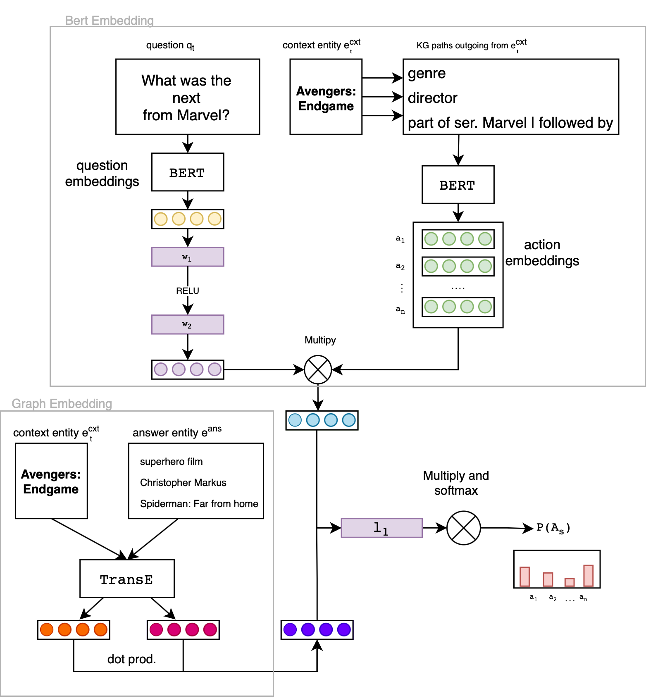

CONQUER: Reinforcement Learning from Reformulations in Conversational QA over KGs
============

Description
------------
Part of Bachelor thesis in the Semantic Systems Research Group Department of Informatics at the University of Hamburg

##
This code work build up on CONQUER. 

### Context Entity Retrieval
The CONQUER model’s error analysis states that 30% of wrong-answered questions result from missing context entities.
To improve context entity detection, this theis explores the impact of semantic similarity measures to detect context entities. 
Using pre-trained Bert models to calculate new sets of context entities.

Models used:

* all-MiniLM-L6-v2
* multi-qu-distilbert-cos-v1

#### Results
The change had no positive impact on the training results. 
This could be because als the parameters were changed, giving the similarity measure 
more impact. When redoing this, it would be better to stick to the original parameters.
Calculating context entities is time-intensive and takes roughly 8 days for all data.

### Graph Embeddings
There are changes in the main training of CONQUER conducted. The model was enriched with
the similarity score (dot prod.) calculated between the graph embedded actions starting and ending points. 
This score will be added to the original Bert score. The distribution of the importance of both scores is learned in form of a linear layer. 

#### Results 
There are/were mistakes in the code. The current changes were not able to be tested.
So further work could be done here. If there are updates this will be changed. There was alo an increase in the run time (an episode takes 6h to train).<