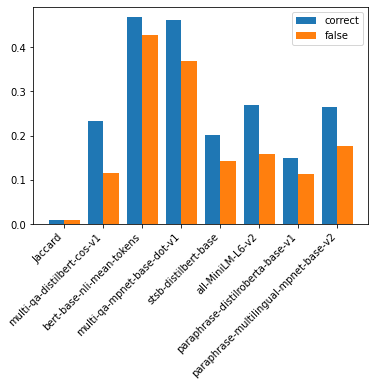

CONQUER: Reinforcement Learning from Reformulations in Conversational QA over KGs
============

Description
------------
## Optimizing Entity Detection
To optimise the Entity Detection the Lexical Match using Jaccard overlap is replaced by Bert model. Using Cosine similarity the similarity between the set of
words in the node label of 𝑛 and all words in 𝑞𝑡 (with stopwords excluded) is calculated. \\
The goal is to optimise the starting points.

## Models (to be continued )

###Models Transformer 
- multi-qa-distilbert-cos-v1 
https://huggingface.co/sentence-transformers/multi-qa-distilbert-cos-v1 \
  This model was tuned for semantic search: Given a query/question, if can find relevant passages
  

- sentence-transformers/bert-base-nli-mean-tokens https://huggingface.co/sentence-transformers/bert-base-nli-mean-tokens \
 ! Model is deprecated ! Currently showing best results
  

- multi-qa-mpnet-base-dot-v1 https://huggingface.co/sentence-transformers/multi-qa-mpnet-base-dot-v1 \
This model was tuned for semantic search: Given a query/question if can find relevant passages. It was trained on a large and diverse set of (question, answer) pairs.

- stsb-distilbert-base

- all-MiniLM-L6-v2

The Test was conducted only with typical conversational utterance to test how robust the system is compared to more complete reformulations

  
-> Best results:
1) sentence-transformers/multi-qa-distilbert-cos-v1
2) all-MiniLM-L6-v2c
3) multi-qa-mpnet-base-dot-v1
4) sentence-transformers/paraphrase-multilingual-mpnet-base-v2